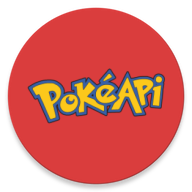

# 
<table>
<header><H1><b>Application Screenshots</header>
<tr>
    <td></td>
    <td></td>
    <td></td>
    <td></td>
    <td></td>
</tr>
<tr>
    <td></td>
    <td></td>
    <td></td>
    <td></td>
    <td></td>
</tr>
</table>

#### Pokémon application is developed to demonstrate how to use MVVM + Modular architecture in android using all below android and Jetpack components in the app.
- Kotlin
- Coroutine
- Lifecycle
- ViewModel
- LiveData
- Dagger/Hilt
- Glide Image Processing Library
- Android SVG (support for Glide SVG loading)
- GSON
- OkHTTP
- Retrofit

#### Testing Dependencies
- JUnit
- mockk
- MockWebServer

# API

PokéApi provides a RESTful API interface to highly detailed objects built from thousands of lines of data related to Pokémon.

For this application we have use v2 of pokeapi.

Api Documentation can be found here [PokéApi](https://pokeapi.co/docs/v2)

# Design

Figma Design link can be found here [Figma](https://www.figma.com/file/MkL0buSb4eyUEqolEvioed/Pokemon_App)

# App Architecture

# Unit test coverage

